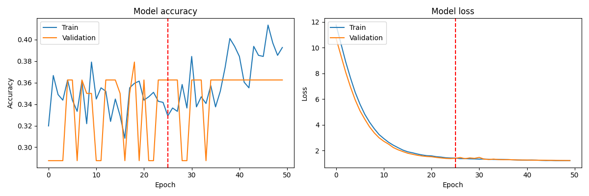
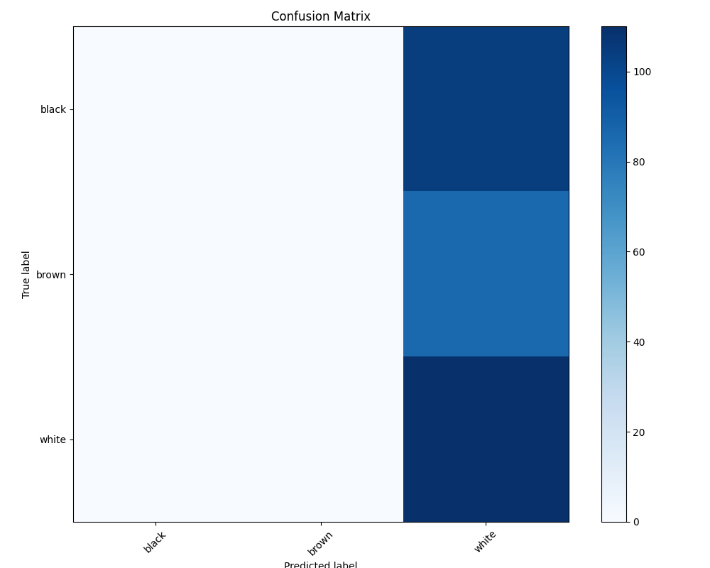

# 🎨 Skin Tone Detection

<p align="center">
  <a href="https://github.com/inquisitour/skin_tone_detection/actions/workflows/pre-commit.yml">
    
  </a>
  <a href="https://github.com/inquisitour/skin_tone_detection/actions/workflows/code_style.yml">
    
  </a>
  <a href="https://github.com/inquisitour/skin_tone_detection/actions/workflows/imports.yml">
    
  </a>
  <a href="https://github.com/inquisitour/skin_tone_detection/blob/main/LICENSE">
    
  </a>
  <a href="https://www.python.org/downloads/">
    
  </a>
</p>

This project implements a robust and adaptive skin tone detection system using deep learning techniques in combination with the DeepGaze library. Our approach integrates computer vision and machine learning to accurately identify and classify various skin tones in images. By leveraging the power of Convolutional Neural Networks (CNNs) and the specialized capabilities of DeepGaze, we've created a system that can reliably detect skin areas and categorize them into distinct tone categories.

<p align="center">
  
</p>

## ✨ Key Features

- 🔍 Utilizes DeepGaze for initial skin detection
- 🧠 Employs a CNN model for accurate skin tone classification
- 🌈 Supports multiple skin tone categories (black, brown, white)

## 🚀 Quick Start

1. Clone the repository:
   ```bash
   git clone https://github.com/inquisitour/skin_tone_detection.git
   cd skin-tone-detection
   ```

2. Set up your environment:
   ```bash
   python -m venv venv
   
   # Activate the virtual environment:-
   # On Windows:
   venv\Scripts\activate

   # On Unix or macOS:
   source venv/bin/activate
   
   # Install required packages:
   pip install -r requirements.txt
   ```

## 🔧 Usage

1. Prepare your dataset in the `data/raw` directory
2. Preprocess the data:
   ```bash
   python data/data_preprocessing.py
   ```
3. Train the model:
   ```bash
   python train.py
   ```
4. Evaluate the model:
   ```bash
   python evaluate.py
   ```
5. Make predictions:
   ```bash
   python predict.py
   ```

For detailed instructions, check out our [Step-by-Step Guide](guide.md) 📚

## 🏗️ Project Structure

```
skin-tone-detection/
│
├── data/               # Raw and processed data
├── models/             # CNN model architecture
├── config.py           # Configuration settings
├── train.py            # Training script
├── predict.py          # Prediction script
├── evaluate.py         # Evaluation script
└── README.md           # You are here!
```

## 🧠 System Architecture

1. **Skin Detection**: DeepGaze library for initial skin area detection
2. **Feature Extraction & Classification**: Custom CNN model for skin tone classification
3. **Post-processing**: Combining DeepGaze skin mask with CNN predictions for final output

## 🔍 Current Results

**Using EfficientNetB0 as the base model**

1. Two-phase training: It first trains the model with a frozen base, then fine-tunes the top layers with a lower learning rate.
2. Separate callbacks for each phase: This allows for saving the best model from each training phase.
3. Comprehensive plotting: The training history plot now shows both training phases, with a vertical line separating them.
4. Informative output: The script prints information about data shapes, training phases, and final accuracies.

**Training History**

<p align="center">
  
</p>

**Confusion Matrix**

<p align="center">
  
</p>

## 🤝 Contributing

We welcome contributions! Please read our [Contributing Guide](CONTRIBUTING.md) for details on our code of conduct and the process for submitting pull requests.

Check out our [Improvement Plan](plan.md) for future enhancements!

---

<p align="center">
  Made with ❤️ by the Gravitas AI Team
</p>
