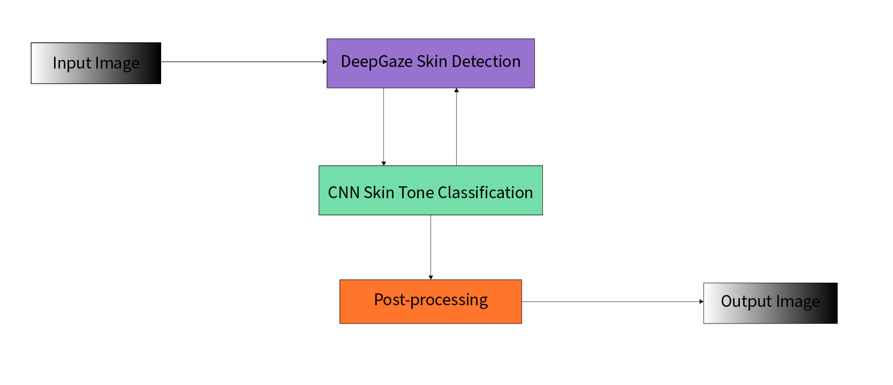

# 🎨 Skin Tone Detection System


This project implements a robust and adaptive skin tone detection system using cutting-edge deep learning techniques in combination with the DeepGaze library.

<p align="center">
  
</p>

## ✨ Key Features

- 🔍 Utilizes DeepGaze for initial skin detection
- 🧠 Employs a CNN model for accurate skin tone classification
- 🌈 Supports multiple skin tone categories (black, brown, white)

## 🚀 Quick Start

1. Clone the repository:
   ```bash
   git clone https://github.com/inquisitour/skin_tone_detection.git
   cd skin-tone-detection
   ```

2. Set up your environment:
   ```bash
   python -m venv venv
   
   # Activate the virtual environment:
   # On Windows:
   venv\Scripts\activate
   # On Unix or macOS:
   source venv/bin/activate
   
   # Install required packages:
   pip install -r requirements.txt
   ```

## 🔧 Usage

1. Prepare your dataset in the `data/raw` directory
2. Preprocess the data:
   ```bash
   python data/data_preprocessing.py
   ```
3. Train the model:
   ```bash
   python train.py
   ```
4. Evaluate the model:
   ```bash
   python evaluate.py
   ```
5. Make predictions:
   ```bash
   python predict.py
   ```

For detailed instructions, check out our [Step-by-Step Guide](guide.md) 📚

## 🏗️ Project Structure

```
skin-tone-detection/
│
├── data/               # Raw and processed data
├── models/             # CNN model architecture
├── utils/              # Utility functions
├── config.py           # Configuration settings
├── train.py            # Training script
├── predict.py          # Prediction script
├── evaluate.py         # Evaluation script
└── README.md           # You are here!
```

## 🧠 System Architecture

1. **Skin Detection**: DeepGaze library for initial skin area detection
2. **Feature Extraction & Classification**: Custom CNN model for skin tone classification
3. **Post-processing**: Combining DeepGaze skin mask with CNN predictions for final output

## 🤝 Contributing

We welcome contributions! Please read our [Contributing Guide](CONTRIBUTING.md) for details on our code of conduct and the process for submitting pull requests.

Check out our [Improvement Plan](plan.md) for future enhancements!

## 📄 License

This project is licensed under the MIT License - see the [LICENSE](LICENSE) file for details.

---

<p align="center">
  Made with ❤️ by the Gravitas AI Team
</p>

